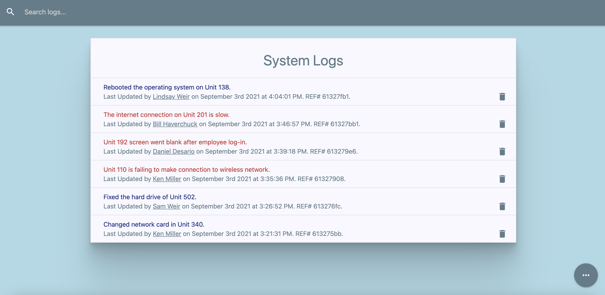

# Tech Clerk

[](https://opensource.org/licenses/MIT)

## Table of Contents

- [Description](#description)
- [User Story](#user-story)
- [Features of the Application](#features-of-the-application)
- [Preview of Tech Clerk](#preview-of-tech-clerk)
- [Links](#links)
- [Built Using](#built-using)
- [Usage](#usage)
- [License](#license)
- [Questions](#questions)

## Description

Welcome to Tech Clerk, a native application that provides an easier way to create, assign, and manage IT work orders.

Tech Clerk is a full stack MERN application that also utilizes Redux for state management. The application is responsive across devices and also utilizes Materialize as a CSS framework. (Originally created with a mock backend using JSON-Server, the application then underwent refactoring where a backend was built.)

Tech Clerk has CRUD capabilities: The user can create a log/technician, update the log status as requiring or not requiring attention, delete any technicians/logs from the system, and search the database for a specific log.

## User Story

```
AS A user
I WANT TO create, assign, and update system logs
SO THAT I can better manage IT work orders.
```

## Features of the Application

```
GIVEN an IT logger application
WHEN I click on the "add log" icon
THEN I can create a log entry and assign a technician to the work order.

WHEN I create a system log entry
THEN I can set whether or not the issue needs attention.

WHEN I click on a generated log entry
THEN I can update the details of that log entry.

WHEN I click on the "technicians" icon
THEN I will see a list of all the technicians.

WHEN I click on the "add a technician" icon
THEN I can fill out a form and create a new technician.

WHEN I click on the trash/delete icon
THEN I can delete a log entry or technician.

WHEN I enter text in the "Search logs..." field
THEN I can search through the database for a specific log.
```

## Preview of Tech Clerk



## Links

- [Deployed Application](https://tech-clerk.herokuapp.com/)

- [Github Repository](https://github.com/rh9891/TechClerk)

## Built Using

Listed below are the frameworks, libraries, and guides that made building this application possible:

- [Express](https://expressjs.com/)
- [JSON-Server](https://github.com/typicode/json-server)
- [MongoDB](https://www.mongodb.com/what-is-mongodb)
- [Node](https://nodejs.org/en/about/)
- [React](https://reactjs.org/docs/getting-started.html)
- [Traversy Media Tutorials](https://www.traversymedia.com)

## Usage

The application can be initiated by inputting `npm run dev` into the command line interface and running the application on `localhost: 3000`.

## License

The MIT License (MIT)

Copyright (c) 2021 Romie Hecdivert

Permission is hereby granted, free of charge, to any person obtaining a copy of this software and associated documentation files (the "Software"), to deal in the Software without restriction, including without limitation the rights to use, copy, modify, merge, publish, distribute, sublicense, and/or sell copies of the Software, and to permit persons to whom the Software is furnished to do so, subject to the following conditions:

The above copyright notice and this permission notice shall be included in all copies or substantial portions of the Software.

THE SOFTWARE IS PROVIDED "AS IS", WITHOUT WARRANTY OF ANY KIND, EXPRESS OR IMPLIED, INCLUDING BUT NOT LIMITED TO THE WARRANTIES OF MERCHANTABILITY, FITNESS FOR A PARTICULAR PURPOSE AND NONINFRINGEMENT. IN NO EVENT SHALL THE AUTHORS OR COPYRIGHT HOLDERS BE LIABLE FOR ANY CLAIM, DAMAGES OR OTHER LIABILITY, WHETHER IN AN ACTION OF CONTRACT, TORT OR OTHERWISE, ARISING FROM, OUT OF OR IN CONNECTION WITH THE SOFTWARE OR THE USE OR OTHER DEALINGS IN THE SOFTWARE.

## Questions

If you have any questions, comments, or issues regarding this application, please do not hesitate to contact me via [Github](https://github.com/rh9891).
